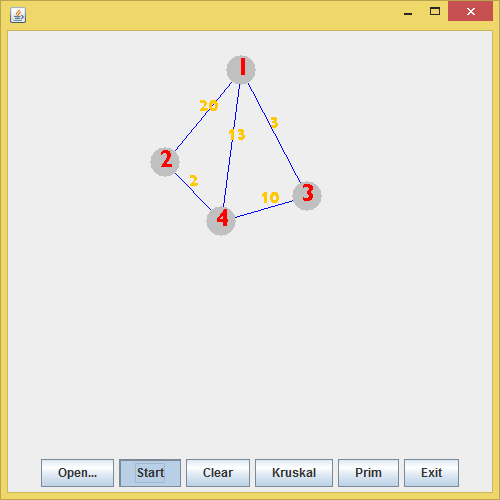
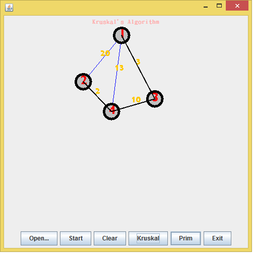

# MST_Demo
By Kruskal and Prim Algorithm

- 透過GUI，模擬Kruskal及Prim演算法畫出最小生成樹(Minimum Spanning Tree)
- 開發語言: Java
- 開發平台: Eclipse
- 應用: `Swing(GUI)`, `File I/O`
- [執行檔下載](https://maxi67.github.io/projects/download/MST_algo.rar)

## 執行截圖
 

## Project 說明
- 設計流程:
GUI元件 -> 設計讀檔 -> 取值-> 作圖 -> 排序法 -> 顯示結果 
- 程式開發流程:
    a). 建立圖形化功能
    
    b). 順利讀檔並清楚管理每個數值
    
    c). 建立2種演算法，並能將結果套用至圖形輸出

## a). 建立圖形化功能
- 視窗大小 500 X 500
- 上半部標籤顯示當前演算法，中間是畫布，最下面按鈕們，左而右依序是:
    - **Open...** : 以`JFileChooser(fc)`建立能讀檔功能的按鈕
    - **Start** : 讀取檔案資料，並以變數及陣列適當管理，然後輸出給繪圖方法
    - **Clear** : 能一次性清除當前畫面
    - **Kruskal / Prim** : 2種演算法作法
    - **Exit** : 結束程式，關閉視窗


>- 因做圖是一層層疊上，進行順序為 Open... -> Start -> Kruskal / Prim
>- 若要觀看另一者要先 Clear 才能 -> Start -> Kruskal / Prim

- 畫面建立後，宣告各個元件，以JPanel作為容器
- 以`bt.addActionListener(this);` 為各按鈕加上動作回應(定義在actionPerformed)
- 其中Open...開啟舊檔時，`f=fc.getSelectedFile();`表示抓到的檔案

### 繪製圖形
```java=
setColor(CostYellow); //決定顏色
setStroke(new BasicStroke(1.0f)); //決定畫筆寬度
fillOval(pointx[i],pointy[i],30,30); //畫實心圓(點)
drawOval(pointx[a], pointy[a], 30, 30); //畫空心圓(用在後面表示演算法結果)
drawLine(pointx[E1[i]], pointy[E1[i]], pointx[E2[i]], pointy[E2[i]]); //畫線(邊)
drawString(String.valueOf(cost[i]), (pointx[E1[i] - 1], pointy[E1[i] - 1]); //寫字(點上的字及成本)
setFont(new Font("Aharoni",Font.BOLD,25)); //決定字型、大小、粗斜體
```

## b). 順利讀檔並清楚管理每個數值
- 啟動Start後，會先執行`openFile(f)`後再繪圖
>因為演算法有重排這些數據，所以在繪圖前執行有重設意義
- 檔案內是數個以逗號隔開的Data
- 讀檔步驟如下:
    - 以readLine()抓整行資訊
    - strs = line.split(","); 可使每筆資料分開
    - 第一個為點數，設為p
    - 第二個為邊數，設為e
    - 之後每三個一組，代表2點+中間邊的cost，用E1、E2和cost儲存，共e組
    - 然後2個一組代表點的位置，x和y座標，用pointx和pointy儲存，共p組
    - 關閉檔案

## c).建立2種演算法，並能將結果套用至圖形輸出
### Kruskal Algorithm
- S1. 先找成本最小的邊，加入MST
- S2. 若MST的邊還不達總點數-1，重作S1，以其次最小成本的邊加入MST，遇到迴圈要跳過
- 要實現能依序找出最小邊，所以先將E1，E2和cost依成本由小到大排序
- 判斷迴圈方法是以vends[]定義為每個點所屬的集合
- 先令所有點屬於不同集合，找到新的邊就讓邊的2端定義為與原本MST內的相同集合
- 若新找到的點2端又屬於同一集合，表示會形成迴路

>示意圖(點1、2、3是當前MST，同屬於集合A，點4是其他的點):
> 1(A)--2(A)--3(A), 4(B)
>- 若新找到的邊2端是(1,3)，則1,3同屬A，會形成迴路
>- 若新找到的邊2端是(1,4)，則1,4分屬A、B，可以加入，並將4歸類為A
>- 每次抓的2端是E1[i]、E2[i] (新增MST的邊)
>- 因此若形成MST，可以直接帶參數給繪圖，最後MST完成
---

>兩種演算法步驟之間，都以下例緩衝(參數表示延遲多少毫秒)
```java=
try
{
	Thread.sleep(500);
}catch(Exception e){}
```

### Prim Algorithm
- S1. 從特定的點出發(本題為1)
- S2. 尋找與MST相鄰當中成本最小的邊構成MST
- S3. 若在MST內還非全部的點，則重作S2，一樣不能形成迴路

由於MST要包含所有點，以`Boolean[] visit`控制還未在MST中的點

- `w[][]`: 從前[]到後[]端點的成本權重陣列
- `parent[]`: 該點的父親(作圖用)
- `dis[]`: 該點與當前MST的最短距離
---
- 先分析從1出發後到各點的距離，取最小的形成下一點，並更新dis及parent
- 有了parent，就可以判斷延伸出去的邊是由誰延伸的，進而幫助作圖
    (新增MST的邊要有起點跟終點)
- 由於每次尋找名單內只有還未加入MST的點，所以不可能出現迴路
- 當visit內皆為true時(該MST已走訪所有點)，最後MST完成
